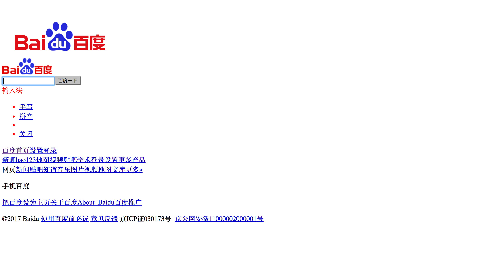

title: 2048 Game in One Day
author:
  name: Seaborn Lee
  twitter: seabornli
  url: http://seabornlee.cn
output: index.html
controls: true

--

# Hack Day
## Create your own 2048 game in step by step

--

### 怎么玩
* 热身
* 环境检查
* 3 Sessions
* 吃饭饭
* 6 Sessions
* 回顾

--

### Session 设置
* 每个 Session 实现一部分功能
* 每个 Session 包含
    * 讲解
    * 示范
    * 编码
    * 辅导
    * 讨论
--

### 需求拆分

* 画出游戏标题
* 画出游戏主界面
* 开始游戏
* 向右移动方块
* 合并方块
* 向其他方向移动
* 重构
* 计分、结束判定
* 部署

--

### Session 1 - 画出游戏标题
* HTML
* .gitignore
* CSS
* JavaScript
* Pixi.js
* 引入外部依赖
* 画出标题
--
# 什么是 HTML？
--
# 程序员和浏览器之间的共同语言
## 程序员通过编写 HTML 告诉浏览器想要展示什么
--
# 什么是 CSS？
--

--

--
# 程序员通过 CSS 告诉浏览器如何让 HTML 更好看
--
# 什么是 JavaScript？
--
# 程序员用 JavaScript 告诉浏览器如何与用户互动
--
### Pixi.js

--
### 画出标题
* PIXI 显示文字
--
### Session 2 - 画出游戏主界面
* 程序 = 数据结构 + 算法
* 数组
--
### Session 3 - 开始游戏
* 产生随机数
* 画出数字
--
### Session 4 - 向右移动方块
* 事件监听
* 回调函数
* 移动元素
--
### Session 5 - 合并方块
* 算法
--
# 思考 5 分钟...
--
### Session 6 -  向其他方向移动
* 算法
--
# 思考 5 分钟...
--
### Session 7 - 重构
* 是什么？
* 为什么？
* 怎么做？
--
### Session 8 - 计分、结束判定
* 累计分数
* 结束判定
* 个性化
--
### Session 9 - 部署
* Github Pages
* Ship it!