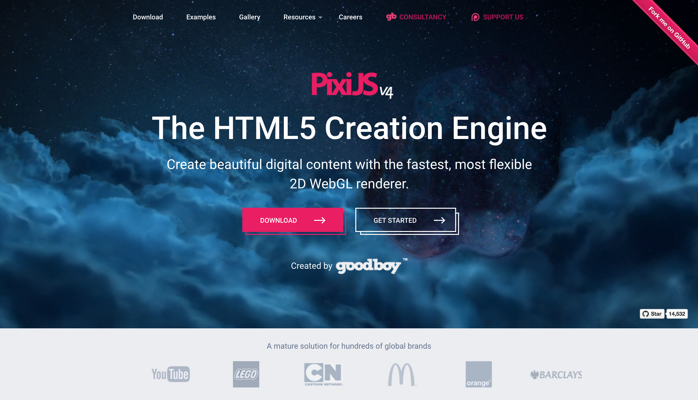

title: 2048 Game in One Day
author:
  name: Seaborn Lee
  twitter: seabornli
  url: http://seabornlee.cn
output: index.html
controls: true

--

# Hack Day
## Create your own 2048 game in 10 hours

--

### 怎么玩
* 热身
* 环境检查
* 2 Sessions
* 吃饭饭
* 5 Sessions
* 回顾

--

### Session 设置
* 每个 Session 实现一部分功能
* 每个 Session 包含
    * 讲解
    * 示范
    * 编码
    * 辅导
    * 讨论
--

### 需求拆分

* 画出游戏标题
* 画出游戏主界面
* 开始游戏
* 向右移动方块
* 合并方块
* 向其他方向移动
* 重构
* 计分、结束判定
* 部署

--

### Session 1 - 画出游戏标题
* HTML
* .gitignore
* CSS
* JavaScript
* Pixi.js
* 引入外部依赖
--
# 什么是 HTML？
--
# 程序员和浏览器之间的共同语言
## 程序员通过编写 HTML 告诉浏览器想要展示什么
--
# 什么是 CSS？
--

--

--
# 程序员通过 CSS 告诉浏览器如何让 HTML 更好看
--
# 什么是 JavaScript？
--
# 程序员用 JavaScript 告诉浏览器如何与用户互动
--
### Pixi.js

--

